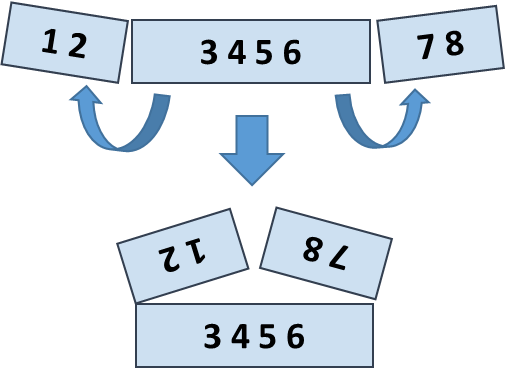

#Week 7

###[Задача 1](1zad.cpp)
Напишете програма, която симулира следното обхождане на редица от числа:
* обхождането започва от текуща позиция - тази с номер __b__
* номера на всяка нова текуща позиция е числото, записано в текущата позиция (Например, ако стоим в позиция 3 и третото число в редиацата е 11, то ще се преместим в позиция 11)
* обхождането завършва, когато отново попаднем в позиция __b__ (ако това изобщо се случи)

Имаме дадена редица и начална позиция, ще приключи ли такова обхождане (за __x__ стъпки) или ще бъде безкрайно?
Няма нужда да проверявате за коректност на входните данни, всички числа от редицата са в интервала [1; __n__]

#####Вход:
* брой на числата в редицата __n__ (1 <= __n__ <= 10^5)
* поредица от __n__ числа
* начална позиция на обхождане __b__ (1 <= __b__ <= __n__ )

#####Изход:
* __x__ - брой елементи в описания цикъл на обхождане, ако обхождането е крайно
* съобщението "Infinite loop", ако то е безкрайно

#####Заб:
Номерацията на позициите в редицата е от 1, за ваше неудобство :grin:

#####Вход 1:
* 5
* 2 5 3 1 1
* 2

#####Изход 1:
* 4 (защото обхождането е през позиции 2-5-1-2)

#####Вход 2:
* 7
* 4 3 6 7 1 7 2
* 4

#####Изход 2:
* Infinite loop (защото обхождането е 4-7-2-3-6-7-2-3-6-7-2-3-6-7-2-3-6-7... и никога не попадаме отново в 4)

#####Вход 3:
* 4
* 1 1 2 2
* 1

#####Изход 3:
* 2 (защото обхождането е 1-1)

Aко имате решение на 1зад, може да го изпратите на bozhin@gmail.com (незадължително домашно)

###[Задача 2](2zad.cpp)
Напишете функция, която чете две думи, съставени от малки латински букви и извежда най-дългия им общ суфикс.

#####Вход:
traktor
tor
#####Изход:
tor

#####Вход:
maimuna
kambana
#####Изход:
na

###[Задача 3](3zad.cpp)
Прочетете число __k__, следвано от масив от 4 * __k__ цели числа и изведете масив от 2 * __k__ числа, получен като сумата на елементите след сгъването (вижте картинката)

#####Вход:
* 8
* 1 2 3 4 5 6 7 8

#####Изход:
5 5 13 13

#####Вход:
* 12
* 4 3 -1 2 5 0 1 9 8 6 7 -2

#####Изход:
1 8 4 -1 16 14

###[Още задачи](03.-Programming-Fundamentals-Arrays-Exercises.docx)
Заб: предназначение са за решаване на C#
